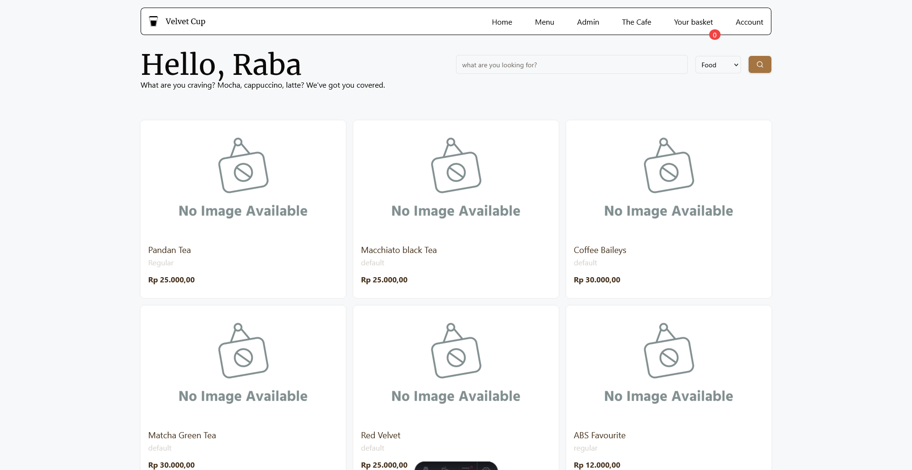

# ☕ Velvet Cup



This repository contains a basic website and web app for Velvet Cup, a fictional
cafe where you can order coffee (among other menus that Velvet Cup
offers) and pay with your favorite method, including cash, Gopay, DANA, or other
QRIS providers.

This project was made in less than a month so apologies for any bugs or unhandled
edge cases.

## 🥪 Stack

This site uses Astro as the backend and API platform. Database connections and
migrations are managed by Kysely, authentication by better-auth and and Vue &
Tailwind for the frontend. Velvet Cup integrates with Midtrans for handling payments.

## 🧞 Commands

this project uses pnpm. install it first:

```sh
npm i -g pnpm
```

All commands are run from the root of the project, from a terminal:

| Command                | Action                                           |
| :--------------------- | :----------------------------------------------- |
| `pnpm install`         | Installs dependencies                            |
| `pnpm dev`             | Starts local dev server at `localhost:4321`      |
| `pnpm build`           | Build your production site to `./dist/`          |
| `pnpm preview`         | Preview your build locally, before deploying     |
| `pnpm astro ...`       | Run CLI commands like `astro add`, `astro check` |
| `pnpm astro -- --help` | Get help using the Astro CLI                     |
